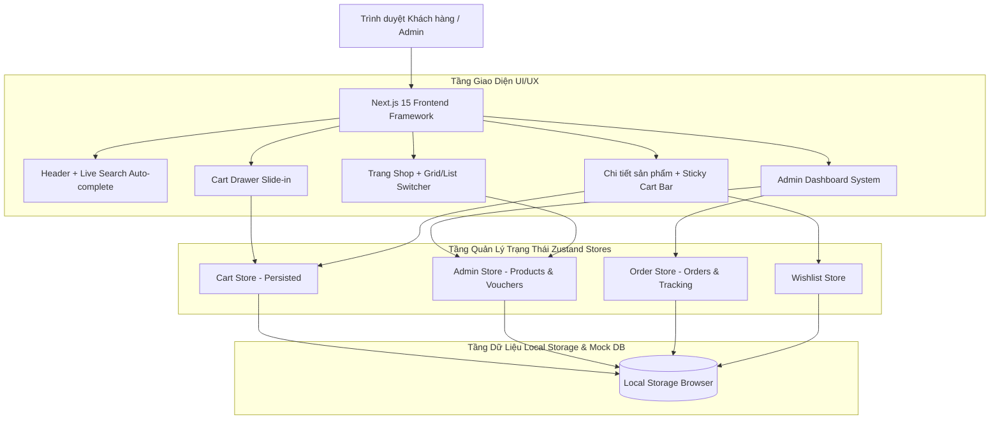
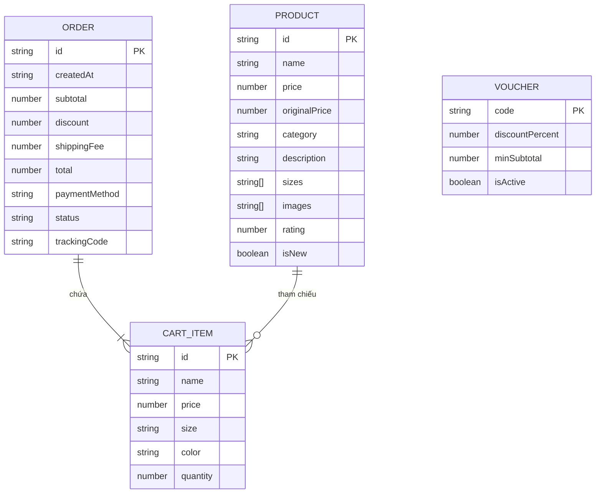

# BÁO CÁO THỰC TẬP NGHỀ NGHIỆP / ĐỒ ÁN MÔN HỌC

## TÊN ĐỀ TÀI: XÂY DỰNG HỆ THỐNG THƯƠNG MẠI ĐIỆN TỬ BÁN ĐỒ THỂ THAO CAO CẤP HIGHTECH SPORTS

- **Sinh viên thực hiện**: [Điền Họ và Tên Sinh Viên]
- **Mã số sinh viên (MSSV)**: [Điền MSSV]
- **Lớp**: IT23D / Khoa Công Nghệ Thông Tin
- **Trường**: Đại học Đông Á
- **Giảng viên hướng dẫn**: [Điền tên Giảng viên]
- **Năm học**: 2026

---

## MỤC LỤC BÁO CÁO

1. **Tổng quan đề tài & Mục tiêu**
2. **Kiến trúc Hệ thống (System Architecture)**
3. **Sơ đồ Use Case (Use Case Diagram)**
4. **Sơ đồ Cơ sở Dữ liệu (Entity Relationship Diagram - ERD)**
5. **Chi tiết Phân hệ Chức năng (Admin & Customer Subsystems)**
6. **Công nghệ & Giải pháp Kỹ thuật áp dụng**
7. **Kết luận & Hướng phát triển**

---

## 1. TỔNG QUAN ĐỀ TÀI & MỤC TIÊU

### 1.1 Tính cấp thiết của đề tài
Trong kỷ nguyên số hóa, thương mại điện tử (E-Commerce) đóng vai trò nòng cốt trong ngành bán lẻ thời trang và trang thiết bị thể thao. Đề tài **"Xây dựng hệ thống thương mại điện tử HIGHTECH Sports"** được triển khai nhằm cung cấp một giải pháp bán hàng trực tuyến toàn diện, nâng cao trải nghiệm người dùng (UI/UX) theo tiêu chuẩn quốc tế của các hãng thể thao danh tiếng như Nike/Adidas, đồng thời xây dựng công cụ quản lý bán hàng (Admin Dashboard) tối ưu cho doanh nghiệp.

### 1.2 Mục tiêu đề tài
- **Đối với Khách hàng (Client)**: Trải nghiệm mua sắm mượt mà, tìm kiếm gợi ý trực tiếp (Live Search), giỏ hàng trượt lướt (Cart Drawer), thả tim yêu thích (Wishlist), thanh toán đa hình thức (COD, QR Momo), theo dõi hành trình đơn hàng (Order Tracking timeline).
- **Đối với Nhà quản lý (Admin)**: Dashboard thống kê KPI doanh thu thời gian thực, quản lý danh mục & kho hàng (CRUD sản phẩm), tiếp nhận và cập nhật trạng thái vận chuyển đơn hàng, quản lý mã giảm giá (Vouchers).

---

## 2. KIẾN TRÚC HỆ THỐNG (SYSTEM ARCHITECTURE)

Hệ thống được thiết kế theo mô hình **App Router (Next.js 15)** kết hợp **Client Component State Management (Zustand Persist)** và **Modular Component Architecture**.



---

## 3. SƠ ĐỒ USE CASE (USE CASE DIAGRAM)

### 3.1 Sơ đồ Use Case Tổng quan Hệ thống

```mermaid
usecaseDiagram
    actor KhachHang as "Khách Hàng (Customer)"
    actor Admin as "Quản Trị Viên (Admin)"

    package "Hệ Thống E-Commerce HIGHTECH Sports" {
        usecase UC1 as "Xem & Tìm kiếm sản phẩm (Live Search)"
        usecase UC2 as "Lọc & Chuyển dạng xem (Grid/List View)"
        usecase UC3 as "Thêm giỏ hàng (Cart Drawer)"
        usecase UC4 as "Thả tim yêu thích (Wishlist)"
        usecase UC5 as "Đặt hàng & Thanh toán (Checkout)"
        usecase UC6 as "Theo dõi đơn hàng (Order Tracking)"
        usecase UC7 as "Xem Dashboard thống kê Doanh thu"
        usecase UC8 as "Quản lý sản phẩm (CRUD Products)"
        usecase UC9 as "Cập nhật trạng thái đơn (Order Status)"
        usecase UC10 as "Quản lý mã giảm giá (Vouchers)"
    }

    KhachHang --> UC1
    KhachHang --> UC2
    KhachHang --> UC3
    KhachHang --> UC4
    KhachHang --> UC5
    KhachHang --> UC6

    Admin --> UC7
    Admin --> UC8
    Admin --> UC9
    Admin --> UC10
```

---

## 4. SƠ ĐỒ CƠ SỞ DỮ LIỆU (ENTITY RELATIONSHIP DIAGRAM - ERD)

Cơ sở dữ liệu được thiết kế gồm 4 thực thể chính: `Product`, `Order`, `CartItem`, `Voucher`.



---

## 5. CHI TIẾT CÁC PHÂN HỆ CHỨC NĂNG

### 5.1 Phân Hệ Khách Hàng (Client Subsystem)
1. **Trang Chủ (`/`)**: Hero Banner typography kiểu Bebas Neue, danh mục sản phẩm hover zoom, sản phẩm nổi bật, banner quảng cáo bộ sưu tập 2025.
2. **Trang Shop (`/shop`)**: Bộ lọc danh mục, lọc khoảng giá slider, chọn chế độ xem dạng **Lưới (Grid View)** hoặc dạng **Danh sách (List View)**.
3. **Trang Chi Tiết (`/product/[id]`)**: Chọn size/màu sắc, bảng quy đổi kích cỡ (Size Guide Modal), badge tồn kho khẩn cấp, thanh Add to cart cố định khi scroll (Sticky Cart Bar).
4. **Giỏ Hàng Slide-in (Cart Drawer)**: Xem & chỉnh sửa sản phẩm giỏ hàng trực tiếp không chuyển trang.
5. **Thanh Toán (`/checkout`)**: Nhập thông tin giao hàng, chọn PTTT (COD, QR Momo/Ngân hàng), nhập mã Voucher giảm giá, trang xác nhận đơn thành công.
6. **Hồ Sơ & Vận Đơn (`/profile`)**: Theo dõi tiến trình đơn hàng (Timeline tracking: Pending -> Processing -> Shipping -> Delivered).
7. **Tin Tức & Thông Tin (`/blog`, `/about`, `/contact`)**: Trang tin tức thể thao, bài viết hướng dẫn chọn giày và form liên hệ.

### 5.2 Phân Hệ Quản Trị (Admin Subsystem)
1. **Dashboard Overview (`/admin`)**: Card KPI thống kê doanh thu, đơn hàng, biểu đồ cột tăng trưởng doanh thu.
2. **Quản Lý Sản Phẩm (`/admin/products`)**: Bảng danh sách sản phẩm, modal Thêm mới & Chỉnh sửa sản phẩm, xóa sản phẩm.
3. **Quản Lý Đơn Hàng (`/admin/orders`)**: Xem danh sách đơn đặt, cập nhật trạng thái đơn hàng thời gian thực.
4. **Quản Lý Mã Giảm Giá (`/admin/vouchers`)**: Tạo mới voucher, bật/tắt kích hoạt mã giảm giá.

---

## 6. CÔNG NGHỆ VÀ GIẢI PHÁP KỸ THUẬT ÁP DỤNG

| Công nghệ | Vai trò & Giải pháp Kỹ thuật |
|---|---|
| **Next.js 15 (App Router)** | Framework cốt lõi hỗ trợ Server & Client Component render tối ưu tốc độ |
| **Tailwind CSS v4** | Utility-first CSS styling với hệ thống Design Tokens (Theme Inline variables) |
| **Framer Motion** | Thư viện tạo chuyển động mượt cho Layout transitions, Drawer slide-in & Modal spring animations |
| **Zustand (with Persist)** | State management quản lý giỏ hàng, wishlist, đơn hàng và lưu dữ liệu LocalStorage |
| **Lucide React** | Bộ icon vector tối giản phong cách Ecommerce hiện đại |

---

## 7. HƯỚNG DẪN CHẠY VÀ DEMO HỆ THỐNG

### 7.1 Lệnh chạy dự án
```bash
# Di chuyển vào thư mục dự án
cd d:\Dai Hoc Dong A 2023-2027\Lap Trinh Web 1\Hightechproject\hightechproject

# Chạy môi trường phát triển (Dev server)
npm run dev

# Truy cập trình duyệt tại: http://localhost:3000
```

### 7.2 Các đường dẫn kiểm thử chính
- **Trang chủ**: `http://localhost:3000`
- **Cửa hàng**: `http://localhost:3000/shop`
- **Thanh toán**: `http://localhost:3000/checkout`
- **Theo dõi đơn hàng**: `http://localhost:3000/profile`
- **Trang Quản trị Admin**: `http://localhost:3000/admin`
- **Quản lý kho Admin**: `http://localhost:3000/admin/products`
- **Quản lý đơn hàng Admin**: `http://localhost:3000/admin/orders`
