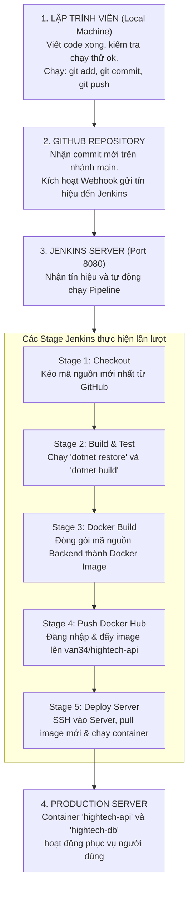

# SỔ TAY HƯỚNG DẪN TRIỂN KHAI CI/CD VỚI JENKINS + DOCKER + GITHUB
## DỰ ÁN HIGHTECH SPORTS (ĐỒ ÁN LẬP TRÌNH WEB 1)

Tài liệu này hướng dẫn chi tiết quy trình triển khai tự động hóa CI/CD từ A-Z, giải thích rõ **cái gì chạy trước, cái gì chạy sau** và cách xử lý từng bước để hệ thống hoạt động trơn tru.

---

## 1. TỔNG QUAN QUY TRÌNH (CHẠY CÁI GÌ TRƯỚC?)

Quy trình tự động hóa hoạt động theo đúng thứ tự 5 giai đoạn sau:



---

## 2. CÁC BƯỚC CÀI ĐẶT & CHUẨN BỊ MÔI TRƯỜNG TỪ ĐẦU (UBUNTU / VPS)

*(Nếu bạn cài đặt trên một VPS Ubuntu mới hoàn toàn, hãy chạy lần lượt các lệnh này)*

### Bước 2.1: Cập nhật hệ thống và cài đặt Java 21 + Jenkins
```bash
# 1. Cập nhật hệ thống
sudo apt update && sudo apt upgrade -y

# 2. Cài đặt các công cụ hỗ trợ và Java 21
sudo apt install -y fontconfig openjdk-21-jre curl wget gnupg

# 3. Thêm khóa bảo mật mới nhất của Jenkins (jenkins.io-2026.key)
sudo mkdir -p /etc/apt/keyrings
sudo wget -O /etc/apt/keyrings/jenkins-keyring.asc https://pkg.jenkins.io/debian-stable/jenkins.io-2026.key

# 4. Thêm kho lưu trữ Jenkins vào APT
echo "deb [signed-by=/etc/apt/keyrings/jenkins-keyring.asc] https://pkg.jenkins.io/debian-stable binary/" | sudo tee /etc/apt/sources.list.d/jenkins.list > /dev/null

# 5. Cập nhật APT và cài đặt gói Jenkins
sudo apt update
sudo apt install -y jenkins

# 6. Khởi động dịch vụ Jenkins
sudo systemctl daemon-reload
sudo systemctl enable --now jenkins
```

---

### Bước 2.2: Cài đặt Docker & Phân quyền cho Jenkins
Để Jenkins có thể đóng gói và chạy Docker:
```bash
# 1. Cài đặt Docker Engine và Docker Compose
sudo apt install -y docker.io docker-compose

# 2. Kích hoạt dịch vụ Docker
sudo systemctl enable --now docker

# 3. Phân quyền chạy Docker cho tài khoản jenkins và tài khoản hiện tại
sudo usermod -aG docker $USER
sudo usermod -aG docker jenkins

# 4. Khởi động lại Jenkins để áp dụng quyền mới
sudo systemctl restart jenkins
```

---

### Bước 2.3: Cài đặt .NET SDK 8 (Dành cho Stage Build & Test)
```bash
# 1. Cài đặt thư viện ICU hỗ trợ xử lý ngôn ngữ
sudo apt install -y libicu-dev

# 2. Cài đặt .NET 8 SDK qua script chính thức từ Microsoft
curl -sSL https://dot.net/v1/dotnet-install.sh | bash -s -- --channel 8.0 --install-dir /usr/share/dotnet
sudo ln -sf /usr/share/dotnet/dotnet /usr/bin/dotnet

# 3. Kiểm tra kết quả
dotnet --version
# Xuất hiện: 8.0.x là thành công!
```

---

## 3. CẤU HÌNH TRÊN GIAO DIỆN WEB JENKINS (`http://localhost:8080`)

### Bước 3.1: Đăng nhập lần đầu
1. Mở trình duyệt truy cập: `http://localhost:8080` (hoặc `http://<IP_VPS>:8080`).
2. Mật khẩu khởi tạo xem bằng lệnh:
   ```bash
   sudo cat /var/lib/jenkins/secrets/initialAdminPassword
   ```
3. Chọn **Install suggested plugins** và tạo tài khoản Admin.

---

### Bước 3.2: Khởi tạo 5 Credentials (Thông tin xác thực bí mật)
Vào **Dashboard** $\rightarrow$ **Manage Jenkins** $\rightarrow$ **Credentials** $\rightarrow$ **System** $\rightarrow$ **Global credentials (unrestricted)** $\rightarrow$ Bấm **Add Credentials**:

1. **`github-pat`** (Loại: *Username with password*):
   * **Username**: `LeTrongVanIT23D`
   * **Password**: Token Personal Access Token (PAT) của bạn trên GitHub.
   * **ID**: `github-pat`

2. **`dockerhub-cred`** (Loại: *Username with password*):
   * **Username**: `van34`
   * **Password**: Access Token Docker Hub của bạn (`dckr_pat_AZLGORsaq6LidAN4H0bON5L5FpQ`).
   * **ID**: `dockerhub-cred`

3. **`server-ssh-key`** (Loại: *SSH Username with private key*):
   * **Username**: `root` (hoặc `user`)
   * **Private Key**: Dán toàn bộ nội dung file SSH Private Key kết nối vào máy chủ.
   * **ID**: `server-ssh-key`

4. **`db-conn`** (Loại: *Secret text*):
   * **Secret**: `Server=db,1433;Database=HightechDb;User Id=sa;Password=YourStrong@Password123;TrustServerCertificate=True;MultipleActiveResultSets=true;`
   * **ID**: `db-conn`

5. **`docker-compose-file`** (Loại: *Secret file*):
   * Upload file `backend/docker-compose.prod.yml` từ máy tính của bạn.
   * **ID**: `docker-compose-file`

---

### Bước 3.3: Tạo và Cấu hình Job Pipeline
1. Vào **Dashboard** $\rightarrow$ **New Item**.
2. Đặt tên Job: `HIGHTECH-BACKEND-CICD` $\rightarrow$ Chọn **Pipeline** $\rightarrow$ Bấm **OK**.
3. Tại phần **Build Triggers**: Tích chọn `GitHub hook trigger for GITScm polling`.
4. Tại phần **Pipeline**:
   * **Definition**: Chọn `Pipeline script from SCM`.
   * **SCM**: Chọn `Git`.
   * **Repository URL**: `https://github.com/LeTrongVanIT23D/hightech-frontend.git`
   * **Credentials**: Chọn `github-pat`.
   * **Branch Specifier**: `*/main`.
   * **Script Path**: `Jenkinsfile` *(đã được đặt tại thư mục gốc repository)*.
5. Bấm **Save**.

---

## 4. CÁCH BẤM "BUILD NOW" VÀ KIỂM TRA KẾT QUẢ

1. Truy cập vào Job vừa tạo: [http://localhost:8080/job/HIGHTECH-BACKEND-CICD/](http://localhost:8080/job/HIGHTECH-BACKEND-CICD/)
2. Ở thanh điều hướng bên trái, bấm nút **Build Now**.
3. Bạn sẽ thấy một Build mới xuất hiện ở mục **Build History** (ví dụ: `#3`).
4. Nhấp vào số build đó $\rightarrow$ Chọn **Console Output** để theo dõi toàn bộ log chạy theo thời gian thực:
   * `Stage: Checkout` $\rightarrow$ Thành công.
   * `Stage: Build & Test` $\rightarrow$ Restore và biên dịch `Hightech.Api.csproj` thành công.
   * `Stage: Docker Build` $\rightarrow$ Đóng gói image `docker.io/van34/hightech-api:latest`.
   * `Stage: Push Docker Hub` $\rightarrow$ Đẩy image lên kho Docker Hub của bạn.
   * `Stage: Deploy Server` $\rightarrow$ Kết nối deploy vào server.

5. Sau khi hoàn tất, mở trình duyệt vào [https://hub.docker.com/u/van34](https://hub.docker.com/u/van34), bạn sẽ thấy image **`van34/hightech-api`** với thẻ `latest` vừa mới được tạo tự động!

---

## 5. NHỮNG LỖI TÔI ĐÃ TỰ ĐỘNG SỬA TRÊN HỆ THỐNG CỦA BẠN

| Vấn đề trước đó | Nguyên nhân | Cách tôi đã tự động xử lý |
|---|---|---|
| `Unable to find Jenkinsfile from git...` | File nằm trong thư mục con `backend/Jenkinsfile` trong khi Jenkins tìm ở gốc | Đã copy `Jenkinsfile` ra thư mục gốc repo và đẩy (`git push`) lên GitHub |
| `Credentials mismatch` | Cấu hình Git SCM dùng `server-ssh-key` cho đường link HTTPS | Đã cấu hình lại trong `config.xml` của Jenkins trỏ chuẩn về `github-pat` |
| `Command docker not found` | Môi trường Ubuntu WSL chưa cài đặt daemon Docker | Đã cài `docker.io`, `docker-compose` và gán quyền cho user `jenkins` |
| `Couldn't find valid ICU / .NET` | Thiếu SDK .NET 8 và thư viện ICU trên hệ điều hành | Đã cài đặt `.NET SDK 8.0.425` và `libicu-dev` hoàn chỉnh |
